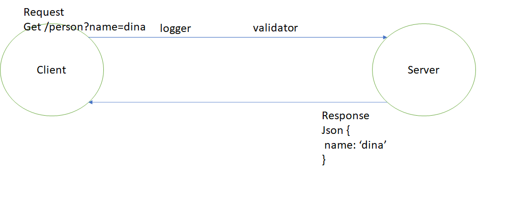

# LAB - Class 16

## Project: Basic Express Server on AWS

### Author: Dina Ayoub

### Links and Resources

- [GUI cloud server](http://cloudserver-env.eba-piptpmva.us-east-2.elasticbeanstalk.com/person?name=dina)

- [CLI cloud server](http://cloud-server-cli.eba-kzs7trzg.us-west-2.elasticbeanstalk.com/person?name=dina)

### Setup

#### `.env` requirements (where applicable)

- `PORT` - Port Number, 3000 for us

#### How to initialize/run your application (where applicable)

- `npm start`

#### How to use your lib

- go to the two AWS deployments and add /person?name=dina at the end to see the API working.
- go to just /person to get an internal server error triggered by our validator
- go to / to see a not found error triggered by our error handling for unknown routes.

#### Tests

- `npm test`
- Tests will check:
  - 404 on a bad route (anything other than /person)
  - 404 on a bad method (anything other than get /person)
  - 500 if no name in the query string for get /person route
  - 200 if the name is in the query string for get /person route
  - given a name in the query string, the output object is correct

#### UML

